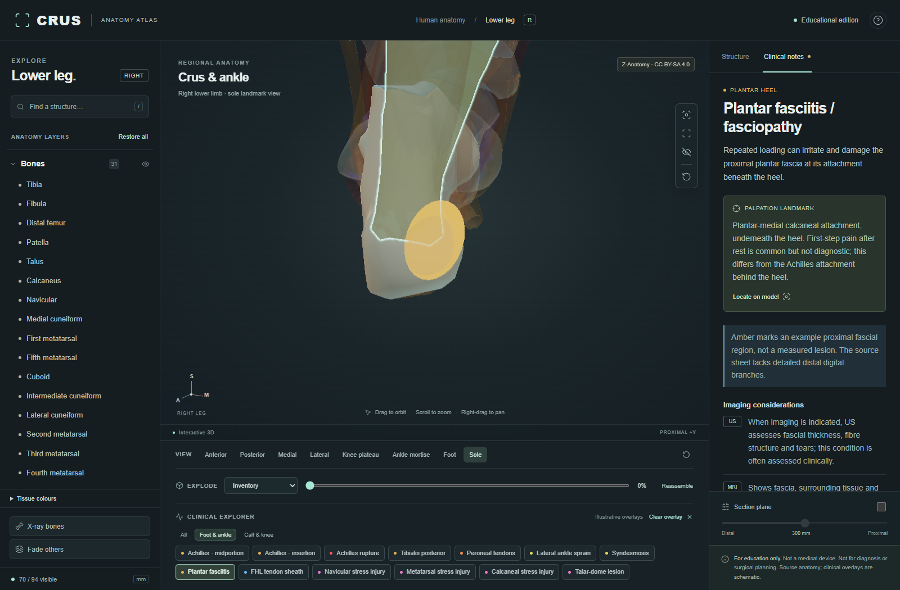
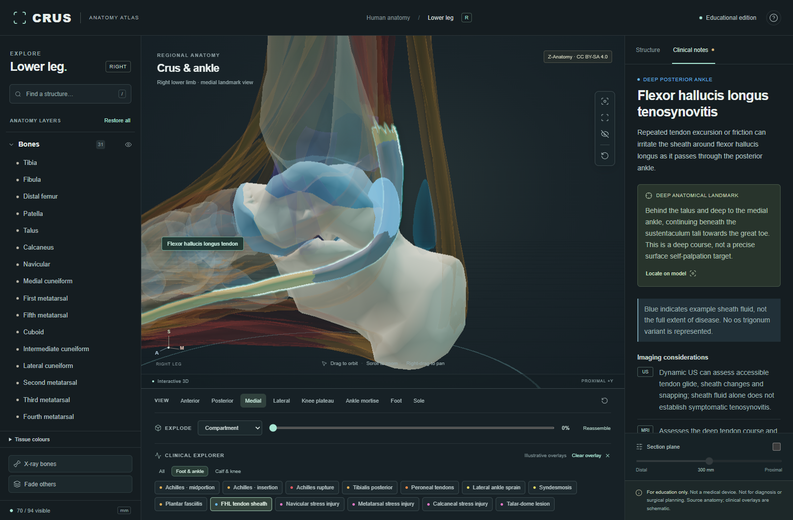
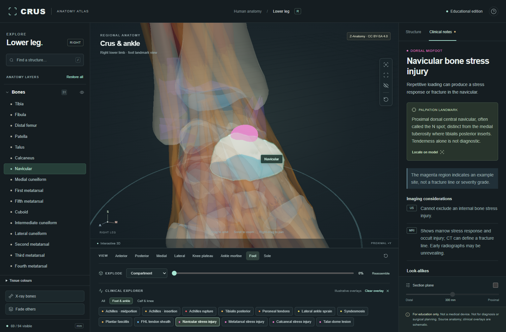
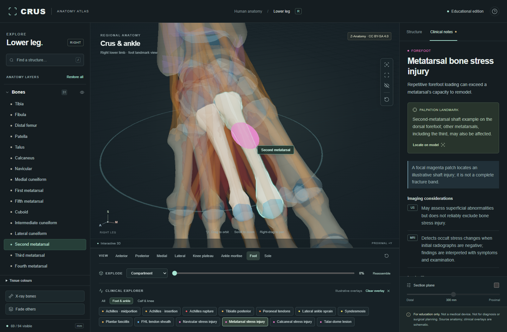
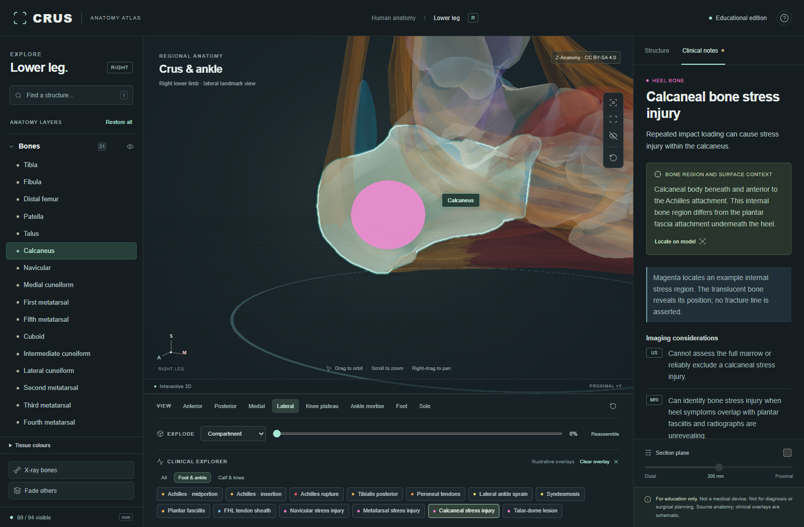
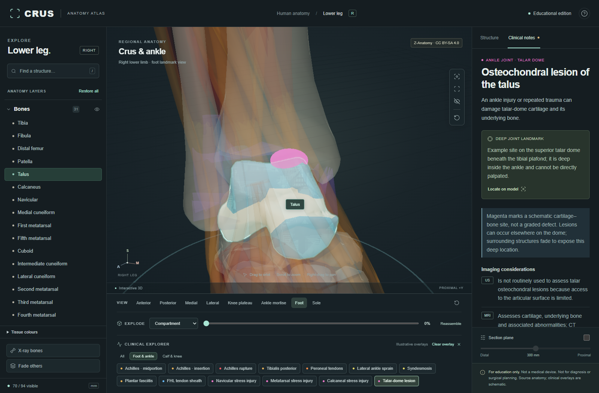
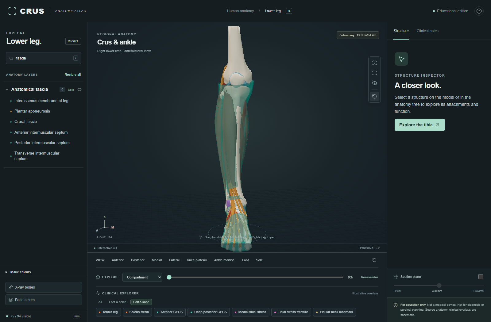
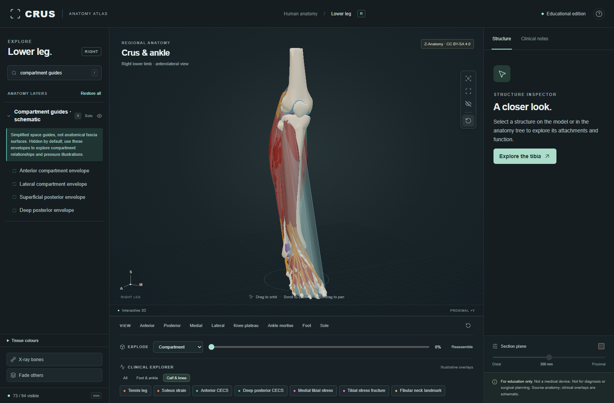

# Foot clinical expansion and fascia presentation

Six new cards bring the atlas to 20 clinical topics while preserving the 94-entry model and all 14 original clinical marker arrays. This pass adds educational regions, not new anatomical geometry, reconstructed fascia or simulated tissue injury. No authored Blender anatomy was needed.

## Cards and registration

| Card | Reviewed region | View | Main evidence |
|---|---|---|---|
| Plantar fasciitis / fasciopathy | Plantar-medial proximal aponeurosis | Sole | [AAOS](https://www.orthoinfo.org/diseases--conditions/plantar-fasciitis-and-bone-spurs), [ACR foot imaging](https://acsearch.acr.org/docs/69424/Narrative/) |
| FHL tenosynovitis | Source FHL sheath behind medial ankle | Medial | [Clinical series](https://pmc.ncbi.nlm.nih.gov/articles/PMC8726539/), [dynamic US case report](https://pubmed.ncbi.nlm.nih.gov/29285554/) |
| Navicular stress injury | Proximal dorsal central navicular | Foot | [Clinical study and N spot](https://pmc.ncbi.nlm.nih.gov/articles/PMC2579456/) |
| Metatarsal stress injury | Dorsal second-metatarsal shaft example | Foot | [AAOS foot stress injuries](https://www.orthoinfo.org/diseases--conditions/stress-fractures-of-the-foot-and-ankle) |
| Calcaneal stress injury | Internal calcaneal body example | Lateral, translucent calcaneus | AAOS foot stress injuries; ACR foot imaging |
| Talar osteochondral lesion | Superior talar dome cartilage/bone site | Foot | [AOFAS](https://www.footcaremd.org/foot-and-ankle-conditions/ankle/osteochondral-lesion), [ACR ankle imaging](https://acsearch.acr.org/docs/69422/Narrative/) |

Use `blender -b --python scripts/register-foot-clinical.py` from the repository root. This reads the accepted generated collection and writes the six regions plus `assets/review/foot-clinical-registration.json`. All existing regions are preserved. The audit pins the shipped GLB hash and records seed coordinates, projected source face and final position. A future model swap needs fresh registration and review, not just a refreshed hash.

Independent geometry review checked surface location and orientation: plantar fascia faces plantar (normal Y about -0.95); navicular faces dorsal/proximal (Y about +0.846); the talar marker lies on the superior dome (Y about +0.903) and coincides with the talocrural cartilage surface. Review rejected the initial metatarsal target on a plantar-facing face. The corrected marker lies on source face 553, normal [-0.203, +0.816, +0.541], with a rounding-level surface distance of 0.000228 mm. Calcaneal stress is intentionally internal. FHL registration identifies a sheath segment, not the superficial Achilles.

Deep FHL and intra-articular talar sites are labelled anatomical landmarks rather than direct palpation targets. Cards explain US/MRI limits, look-alikes and schematic overlay status. No diagnostic thresholds or treatment protocols were added. Plantar heel symptoms are not presented as an explanation for upper calf pain. Sheath fluid alone is not labelled diagnostic.

## Layer presentation

Anatomical fascia has six source sheets; Compartment guides · schematic has four unchanged frozen hulls. Their show/hide/solo controls are independent. Guides use subdued grey-blue, 18% surface opacity, restrained edges and hollow swatches; anatomy fascia retains its source colours and 65% opacity. This is a presentation correction, not a smoothing or reconstruction claim. Covering layers remain off by default. Clinical-only reveals are reversed on clear/switch, while explicit layer toggles are retained.

The original GLB, source geometry, stable IDs, provenance and manifest are unchanged. Existing coarse fascial edges, absent distal plantar branching, disputed retinaculum and other recorded anatomical gaps remain unresolved.

## Verification

- Nine tests and production build passed. Vite retains the existing Three.js bundle-size advisory.
- Independent code/data review confirmed all original 14 marker arrays and model assets unchanged.
- Browser review at 1600 × 1050 exercised all six cards, region filters retaining the selected card, Locate, independent fascia/guide toggles, three explode modes, reassembly and reset. Clear/switch restored clinical-only layers, including CECS guides. No page errors were captured.
- Source landmarks, clinical reference review and saved views are technical/educational checks, not independent clinical validation. Performance on a representative laptop and a full accessibility audit were not performed.
- The first browser capture run was interrupted by development hot reload during concurrent edits; rerun against stable code passed. Playwright CLI was unavailable offline; the bundled Playwright runtime produced the saved views without a project dependency.

## Saved views

