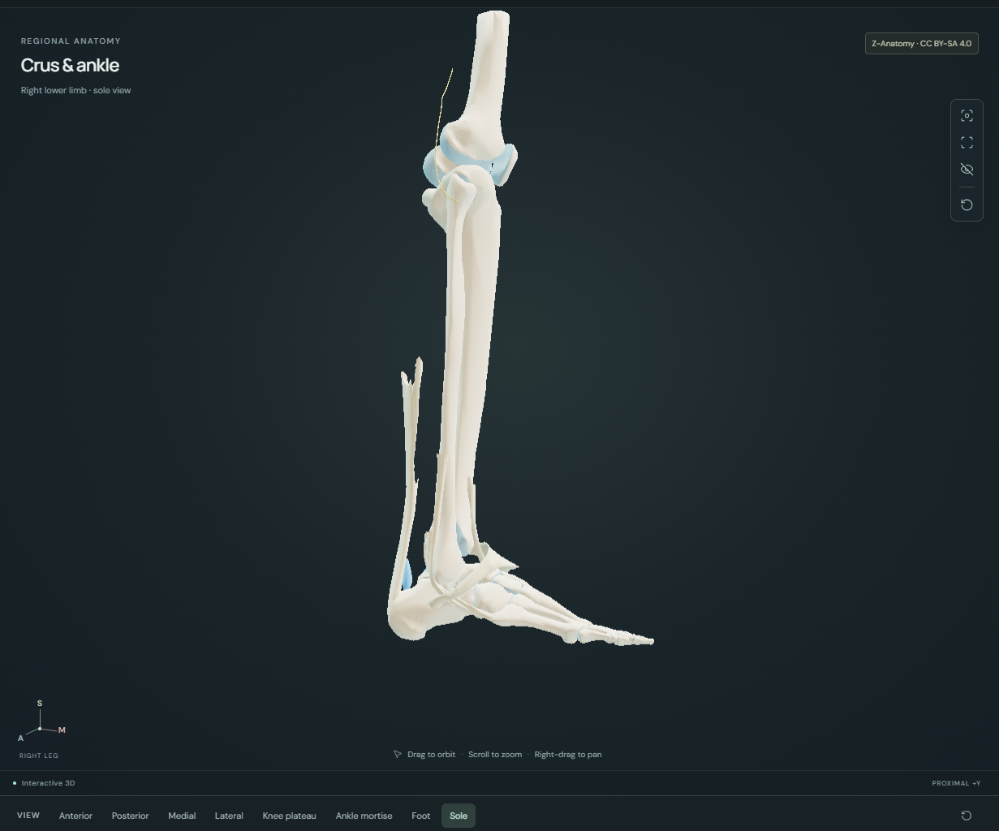
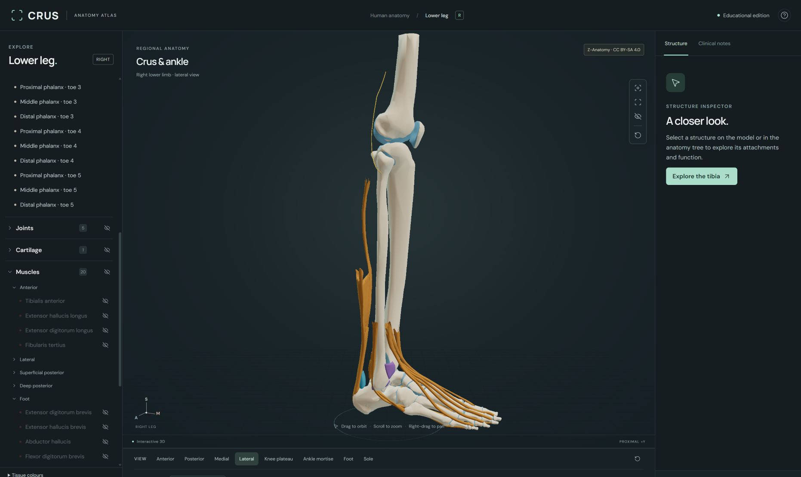
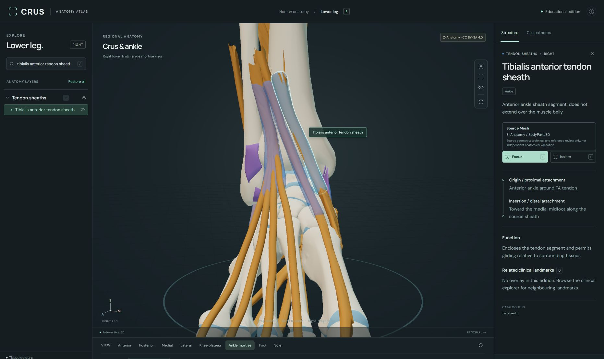
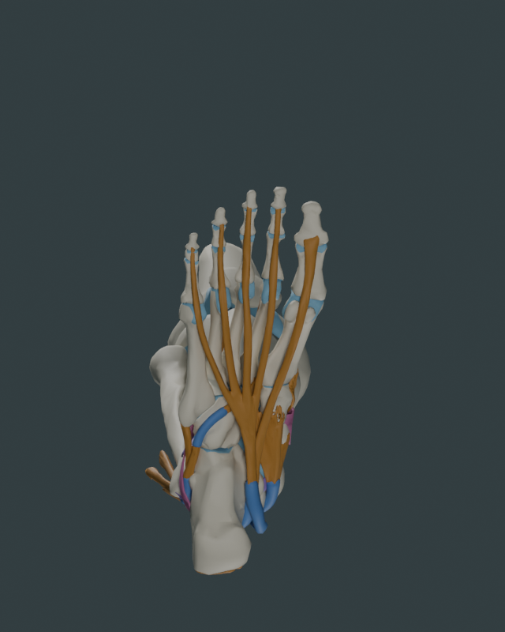
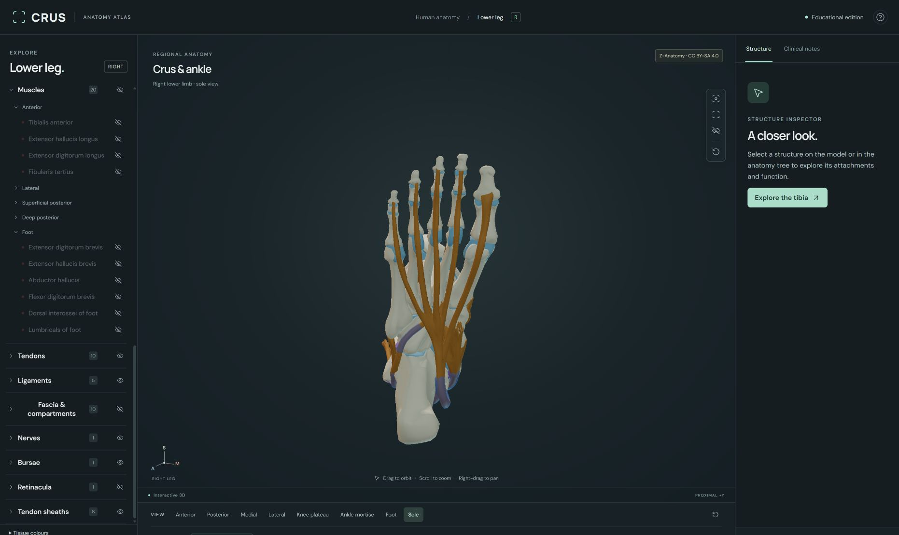

# Supplementation and contrast review — 2026-09-07

Educational model review, not clinical validation. Public repository:
[HolsteredSoul/crus-atlas](https://github.com/HolsteredSoul/crus-atlas).
Baseline history was retained and published first after a text-history credential
scan found no matching secrets. GitHub Pages deployment subsequently completed.

**Latest pilot update:** the atlas now has 94 entries. The anterior tibiotalar gap is represented by an interpreted source component, separated without changing assembled geometry. [Pilot evidence and remaining uncertainty](DATTL-PILOT.md). The 93-entry counts and initial G exclusion below describe the preceding A–F review.

## Delivered and limited coverage

| Batch | Result | Limits |
|---|---|---|
| Contrast | Shared palette in exporter, app and swatches; tissue-region vertex colours, lower lighting/exposure, compact legend | Colours are an educational convention |
| A | Separate EDL tendon including its standalone source object | Source-defined tendon boundary, not histological segmentation |
| B | Separate EHL, FHL, FDL and plantaris tendons; muscle IDs retained | Source shape/course retained; fine attachment completeness is not established |
| C | Source interosseous membrane | Distal IOL is not a separately represented region |
| D | Source central plantar aponeurosis | Distal digital branching, dermal and plantar-plate connections unresolved |
| E | Crural fascia plus anterior, posterior and transverse septa | Source sheets do not establish sealed or complete compartment topology |
| F | Eight sheath entries: TA, EHL, common EDL/FT, TP, FDL, FHL, common fibular, plantar fibularis longus | Short source segments, not invented full-length sleeves; exact enclosure/contact not clinically validated |
| G | Source candidates and receiving surfaces inspected; three reconstructions excluded | See individual registration failures below |

The atlas has **93 stable IDs**, nineteen more than the 74-entry baseline: five
tendon partitions, six fascia/aponeurosis additions and eight sheaths. No authored
reconstruction was accepted. Original compartment illustration geometry and all
clinical landmark coordinates were preserved. Plantaris tendon is included in
the tennis-leg context without moving its injury markers.

The pre-existing `superior_fibular_retinaculum` source spans the anterior ankle,
which conflicts with its claimed retromalleolar identity. It is one connected
sheet, so no independently supported superior-fibular component could simply be
separated. Its historical ID and geometry remain available for inspection, but its
display name says **source label disputed**, attachment/function claims were
removed, and it is hidden by default. It is not relabelled as a verified extensor
retinaculum. This is a disclosed source exception, not accepted identified anatomy.

## G — individually excluded candidates

| Candidate | Observed reason for exclusion | Evidence needed to proceed |
|---|---|---|
| Distal interosseous ligament | Single-bone facing surfaces lack reproducible footprint boundaries; membrane sections show a thin continuation without a supported graded thickened transition | Paired source-specific footprint annotations or a registered donor ligament with supported transition/perforator relationships |
| Anterior tibiotalar ligament | Exposed medial/oblique bone views do not resolve the collicular/intercollicular origin and small talar footprint below the trochlear margin sufficiently | Registered attachment annotations or higher-detail registered bone/ligament geometry |
| Tibiospring ligament | Available plantar calcaneonavicular mesh is an 18-vertex, 16-face plantar strap, without an identifiable superomedial spring receiving surface | Verified spring receiving surface and source-registered tibial/soft-tissue attachments |

These exclusions follow inspection of actual source geometry, not just missing
object names. General literature anatomy cannot supply exact attachment points
on this coarse source without an additional registration judgment. The deltoid
and syndesmosis detail cards now explicitly state their missing components.
[Anatomical evidence and independent critique](anatomical-references.md) and
[machine-readable gaps](../../assets/unresolved.json) retain the references.

## Verification and artifacts

- Seven automated tests cover actual GLB Draco/COLOR_0, exact catalogue membership,
  metadata/provenance rejection, source bounds, marker integrity, tendon face
  conservation, inventory separation and hierarchical weights.
- Independent regression review compared all 69 unsplit baseline IDs: vertex
  counts, polygon counts and bounds match. All five new muscle/tendon pairs
  conserve their original face totals. This is not a claimed vertex-by-vertex
  comparison of compressed files. The exporter copies every evaluated source face
  exactly once into each partition pair and preserves its vertex positions.
- Source checksum is verified on every rebuild; the source archive revision is
  recorded in `assets/source.json`. The original hulls are frozen separately.
- Blender review includes isolated/assembled tendon and sheath views, three calf
  sections, medial/oblique bone-only ankle views, single-bone distal facing surfaces
  and the spring candidate. Planar section caps are review-only. Early offset
  views were insufficient to expose the interval; subsequent single-bone views
  supplied that evidence.
- A clean background Blender rebuild checks reproducibility independently of the
  working scene. Active-scene-only export prevents other scenes' selected objects
  from entering the GLB. Compact collection libraries avoid a Blender 5.2
  scene-library copy crash; append their named collections into Blender.
- Final verification passed: **7/7 tests**, TypeScript and Vite production build;
  fresh Blender read-back verified all 93 atlas IDs and the explicit nine-object
  candidate set. Both libraries have the intended covering-layer defaults.
- Browser checks exercised direct ray picking of an isolated translucent TA sheath,
  selection/details, hide/reset keys, search, focus, isolation, X-ray/fade controls,
  clipping controls, all three explode modes and reassembly. Sole focus preserved
  the underside view. Tennis-leg context includes plantaris tendon; its existing
  marker and differential card remain visible. CECS and Achilles rupture controls
  were exercised, with all marker coordinates additionally checked unchanged.
- Final connective-tissue views were inspected with muscles hidden, around the
  ankle, beneath the foot and with sheaths overlapping their tendon routes.
  These are interaction/overview checks, not exhaustive per-face contact or
  clinical validation.

Editable files: `assets/generated/crus-atlas.blend` and the separate unaccepted
`assets/review/ligament-candidates.blend`. Future authored assets belong in
`assets/authored/`; regeneration never overwrites that directory. Review images
are under `images/`. Downloaded whole-body assets and temporary outputs are ignored.

No representative-device 60-fps benchmark, full accessibility audit, independent
clinical validation or complete anatomical validation has been performed. The
retained standard Three.js chunk-size warning does not indicate a failed build.
